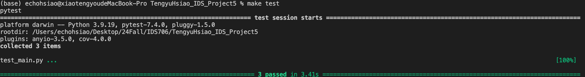

# TengyuHsiao_IDS_project5
# CRUD Operations for Student Database

This project demonstrates basic CRUD (Create, Read, Update, Delete) operations on a simple SQLite database containing student information. The database operations include the ability to add, update, delete, and query students in a SQLite database.

## Features

- Connect to an SQLite database
- Create a `student` table contains s_id, name, age if it doesn't exist
- Insert new student records
- Update existing student records
- Delete student records
- Query student records with two different queries:
  - Fetch all students
  - Fetch students equal specified age

## Test

In test_main.py, I perform several tests to make sure my CRUD as well as the 2 extra queries works for my database, the following is a screenshot of the successful tests 
