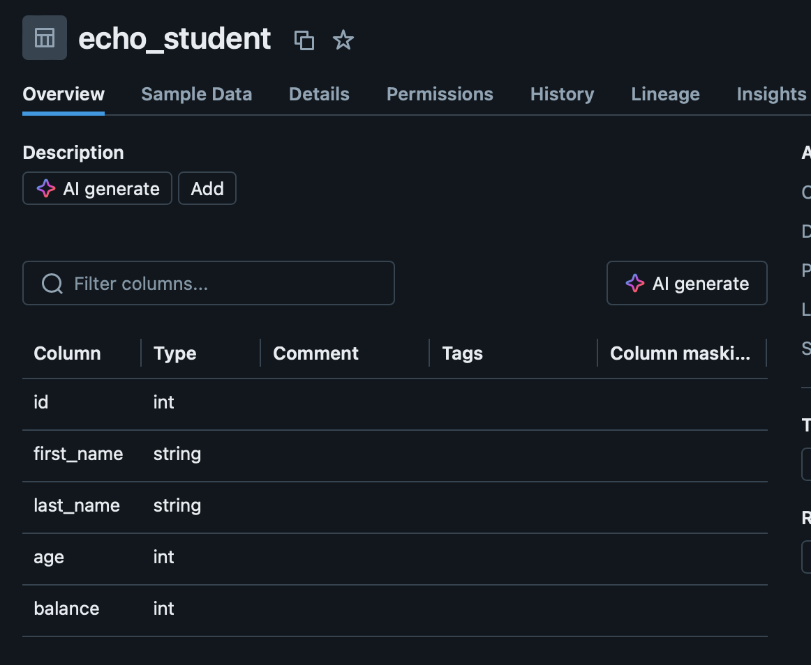
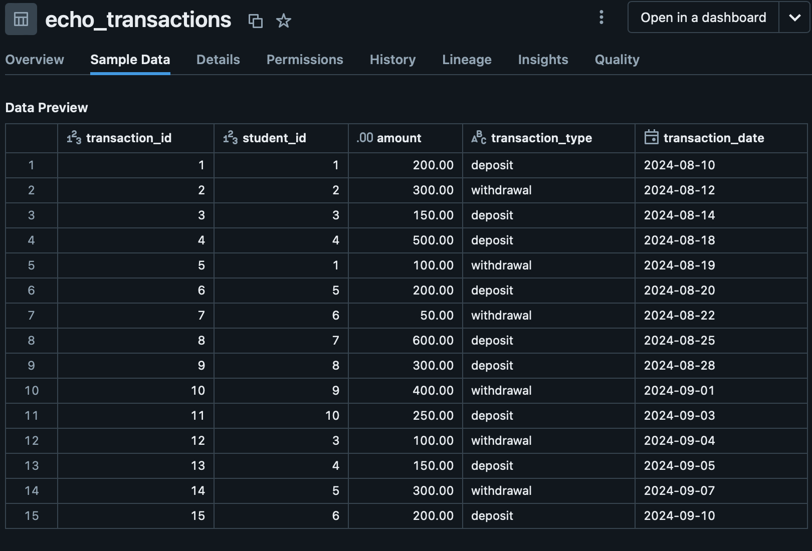

# TengyuHsiao_IDS_Individual2
# Complex SQL Query for a MySQL Database

## Features

- Connect to an Daatbricks database
- Create a `student` table contains student_id,first_name,last_name,age
balance if it doesn't exist

- Create a `transaction` table contains transaction_id,student_id,amount,
transaction_type,transaction_date if it doesn't exist

- Read and insert data to both tables from csv
- Complete a complex SQL query involving joins, aggregation, and sorting

## About my query :
This is my query:

SELECT s.id, s.first_name, s.last_name, COUNT(t.transaction_id) AS total_transactions,
                           SUM(CASE WHEN t.transaction_type = 'deposit' THEN t.amount ELSE 0 END) AS total_deposited
                           FROM echo_student s
                           LEFT JOIN 
                           echo_transactions t ON s.id = t.student_id
                           GROUP BY 
                           s.id, s.first_name, s.last_name
                           ORDER BY 
                           total_deposited DESC;

This query will allow you to see which students are most active in terms of deposits, allowing you to analyze both the number of transactions and the total value of deposits.

## OUTPUT of my query :
Row(id=4, first_name='Emily', last_name='Brown', total_transactions=2, total_deposited=Decimal('650.00'))

Row(id=7, first_name='James', last_name='Anderson', total_transactions=1, total_deposited=Decimal('600.00'))

Row(id=8, first_name='Laura', last_name='Garcia', total_transactions=1, total_deposited=Decimal('300.00'))

Row(id=10, first_name='Jessica', last_name='Lee', total_transactions=1, total_deposited=Decimal('250.00'))

Row(id=1, first_name='John', last_name='Doe', total_transactions=2, total_deposited=Decimal('200.00'))

Row(id=6, first_name='Sarah', last_name='Taylor', total_transactions=2, total_deposited=Decimal('200.00'))

Row(id=5, first_name='David', last_name='Wilson', total_transactions=2, total_deposited=Decimal('200.00'))

Row(id=3, first_name='Michael', last_name='Johnson', total_transactions=2, total_deposited=Decimal('150.00'))

Row(id=9, first_name='Robert', last_name='Martinez', total_transactions=1, total_deposited=Decimal('0.00'))

Row(id=2, first_name='Jane', last_name='Smith', total_transactions=1, total_deposited=Decimal('0.00'))

## Test

In test_main.py, I perform several tests to make sure my loading of the data as well as the query works for my database, the following is a screenshot of the successful tests 
